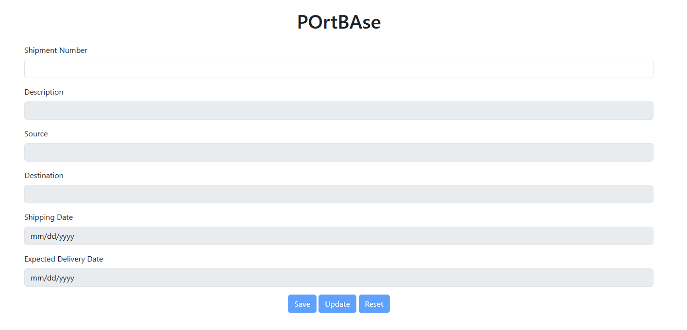
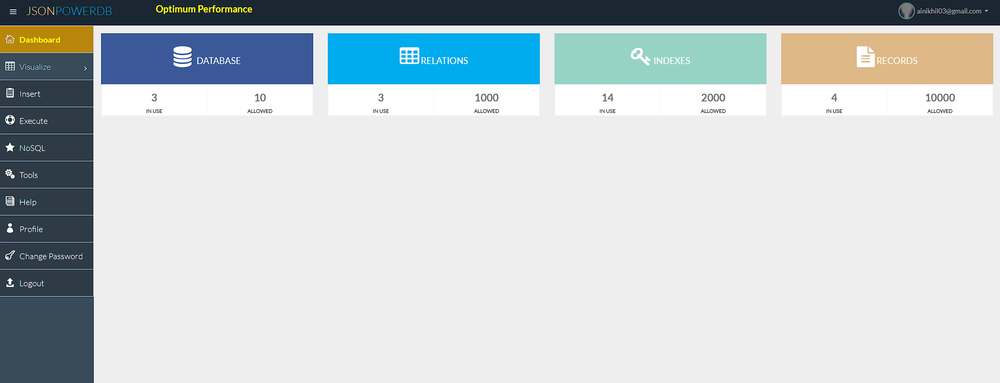

# JasonPDB_Shipment_DB
A simple form with some data for entering data and retrieving it
# 🚢 Shipment Management Form

A web-based form built using HTML, Bootstrap, jQuery, and JsonPowerDB to manage shipment records. It allows users to create, update, and reset shipment entries in a secure and efficient way.

---

## 📄 Table of Contents

- [Project Description](#project-description)
- [Benefits of Using JsonPowerDB](#benefits-of-using-jsonpowerdb)
- [Scope of Functionalities](#scope-of-functionalities)
- [Examples of Use](#examples-of-use)
- [Illustrations](#illustrations)
- [Project Status](#project-status)
- [Release History](#release-history)
- [Sources](#sources)
- [Other Information](#other-information)

---

## 📘 Project Description

This project is a **Shipment Management Form** that interacts with the `SHIPMENT-TABLE` in the `DELIVERY-DB` database hosted on JsonPowerDB. It supports:

- Entry of new shipment records
- Retrieval and update of existing records
- Form reset and validation
- Local storage of record identifiers

---

## 🚀 Benefits of Using JsonPowerDB

- **Lightweight & Fast**: Ideal for small-scale applications and rapid prototyping.
- **NoSQL Flexibility**: Schema-less structure allows dynamic data modeling.
- **Built-in Security**: Token-based authentication for secure access.
- **RESTful API**: Easy integration with frontend JavaScript.
- **Low Latency**: Optimized for quick read/write operations.

---

## 🧩 Scope of Functionalities

- ✅ Add new shipment records
- ✅ Auto-check for existing records using primary key
- ✅ Populate form with existing data
- ✅ Update shipment details
- ✅ Reset form to initial state
- ✅ Validate all fields before submission
- ✅ Store record ID in `localStorage`

---

## 🧪 Examples of Use

1. **Enter Shipment Number** → If not found, form unlocks for new entry.
2. **Enter Details** → Click **Save** to store in JsonPowerDB.
3. **Enter Existing Shipment Number** → Form auto-fills → Click **Update** to modify.
4. **Click Reset** → Clears form and returns to initial state.

---

## 🖼️ Illustrations
*Example of the form layout with Bootstrap styling.*
  
*JPDB home page*

---

## 📦 Release History

- **v1.0.0** — Initial release with full CRUD functionality using JsonPowerDB  
- **v1.1.0** — Refactored for async AJAX and improved error handling  
- **v1.2.0** — Added local fallback for JPDB helper functions

---

## 📚 Sources

- [JsonPowerDB Documentation](https://login2explore.com/jpdb/docs.html)
- [Bootstrap 5](https://getbootstrap.com/)
- [jQuery](https://jquery.com/)

---

## 🧠 Other Information

- Developed as part of a web development assignment

---
